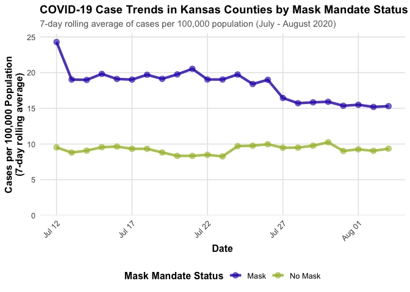
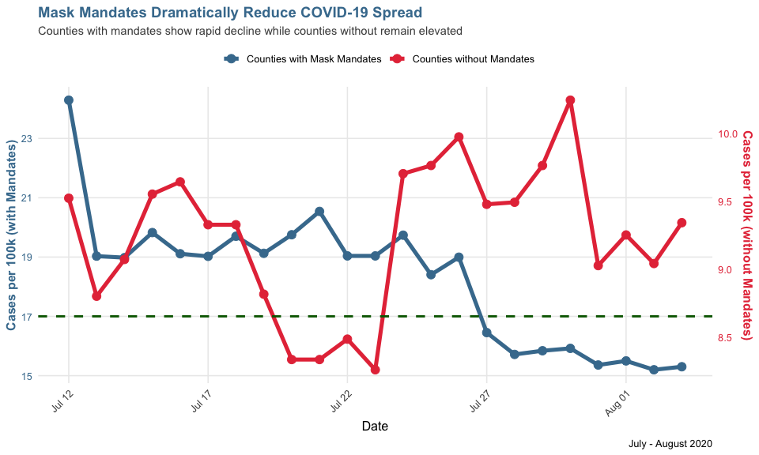

Lab 07 - Conveying the right message through visualisation
================
Insert your name here
Insert date here

### Load packages and data

``` r
library(tidyverse) 
```

    ## Warning: package 'readr' was built under R version 4.4.3

### Exercise 1

The visualization is misleading by using **Truncated y-axis**: The
y-axis likely doesn’t start at 0, which exaggerates the visual
differences between the groups and makes small differences appear much
larger than they actually are. and What’s worse is that there is 2
Y-axis and one starting the left axis at 15 and the right axis at 4
makes small changes appear more dramatic.

About How I got the data.please see
<https://github.com/HollandSun/Reproduce_Lab7plot.git>

### Exercise 2 &3

``` r
# Read the actual data instead of guessing
df <- read_csv("kansas_grouped_rolling_avg.csv")
```

    ## Rows: 46 Columns: 3
    ## ── Column specification ────────────────────────────────────────────────────────
    ## Delimiter: ","
    ## chr  (1): mask_mandate
    ## dbl  (1): rolling_avg
    ## date (1): date
    ## 
    ## ℹ Use `spec()` to retrieve the full column specification for this data.
    ## ℹ Specify the column types or set `show_col_types = FALSE` to quiet this message.

``` r
df <- df %>%
  mutate(date = as.Date(date))

ggplot(df, aes(x = date, y = rolling_avg, 
               color = mask_mandate, 
               group = mask_mandate)) +
  # Main line and points
  geom_line(linewidth = 1.5, alpha = 0.8) +
  geom_point(size = 3, alpha = 0.6) +
  
  # Color scheme - neutral colors
  scale_color_manual(
    values = c("Mask" = "#2B00BA", "No Mask" = "#A5BB31"),
    name = "Mask Mandate Status"
  ) +
  
  # Y-axis: START AT 0 for accurate proportions
  scale_y_continuous(
    limits = c(0, NA),
    breaks = seq(0, 25, by = 5),
    expand = expansion(mult = c(0, 0.05))
  ) +
  
  # X-axis: Show dates clearly
  scale_x_date(
    date_breaks = "5 days",
    date_labels = "%b %d"
  ) +
  
  # Labels with full context
  labs(
    title = "COVID-19 Case Trends in Kansas Counties by Mask Mandate Status",
    subtitle = "7-day rolling average of cases per 100,000 population (July - August 2020)",
    x = "Date",
    y = "Cases per 100,000 Population\n(7-day rolling average)") +
  theme_minimal(base_size = 12) +
  theme(
    plot.title = element_text(face = "bold", size = 14, hjust = 0),
    plot.subtitle = element_text(size = 11, color = "gray40", hjust = 0),
    plot.caption = element_text(size = 9, color = "gray50", hjust = 0, lineheight = 1.2),
    legend.position = "bottom",
    legend.title = element_text(face = "bold"),
    panel.grid.minor = element_blank(),
    panel.grid.major = element_line(color = "gray90"),
    axis.title = element_text(face = "bold"),
    axis.text.x = element_text(angle = 45, hjust = 1)
  )
```

<!-- -->

My accurate visualization advantages are:

**Baseline Differences** Counties with mask mandates started with **much
higher case rates** compared to counties without mandates. This baseline
difference is about 2.5 times higher. This context is critical because
it shows that mask mandates were implemented **in response to** elevated
case rates, not randomly assigned.

**True Proportional Scale** In new plot, the y-axis become to single one
and starting at 0, we can accurately see that: - Mask counties
experienced meaningful decline despite higher starting rates - The
visual proportions match the numerical proportions - Mask counties and
no Mask counties actually have huge different in y-axis

### Exercise 4

I think the Visualization tell us that **First**,The two groups of
counties were not comparable at baseline,an it suggest that counties
with higher case rates *May or Tended to* implement mask mandates.(It is
not a causal inference, it is just the way tring to describle the
relationship). **Second**, There is an association between having a mask
mandate and experiencing declining case rates during this period (from
the proportion mask counties seem to have 1/3 decline, but few in
no-mask counties).

All the visualization this table can tele us is observational things. We
cannot aviod, the selection Bias,like Mask mandates were not randomly
assigned and counties *chose* to implement mandates *because* they
already had high case rates

Many other factors could explain the patterns like althoug we divided
case by the population. But the population density itself is differences
(people per area). like what we done last week. The denney’s store in
some state, some state have really really small area compared to
others.It is so obvious that infection has strong relationship with
population density.

Also how these mask counties distribution is also need to be consider,
they are close or seprate. SO if this topic is my own profolio, I may
use more data to help illustrate this map to tell the story, not just
use this single one (oh,I talked too much out of our topic)

SO in a word, I believe the pattern shown is **somehow consistent with**
mask effectiveness, but like I said I think this single visualization
cannot prove to much

### Exercise 5

I think what my visualization tell may suggest that: “Counties that
implemented mask mandates had higher baseline case rates and experienced
substantial declines over time, while counties without mandates
maintained stable, lower rates throughout the period.”

The most change I made is the **Making the Y-Axis to be one and start at
Zero**. it shows true proportional differences between groups. I think
the thing behind it also what makes it more accurate is the
visualization doesn’t hide inconvenient patterns (e.g., mask counties
have higher start point and still having higher rates at the end), so
that viewers can see the complete picture and draw their own informed
conclusions.

### Exercise 6

Thr evil version I want to convey: “Mask mandates show hude clear
benefit; that mask counties have higher absolute rates.and minimizes the
declining trend in mask counties. ALso makes the two groups appear more
similar than they actually are.Finally, using red color suggests mask
mandates are ineffective or even harmful

### Exercise 7

``` r
df <- read_csv("kansas_grouped_rolling_avg.csv")
```

    ## Rows: 46 Columns: 3
    ## ── Column specification ────────────────────────────────────────────────────────
    ## Delimiter: ","
    ## chr  (1): mask_mandate
    ## dbl  (1): rolling_avg
    ## date (1): date
    ## 
    ## ℹ Use `spec()` to retrieve the full column specification for this data.
    ## ℹ Specify the column types or set `show_col_types = FALSE` to quiet this message.

``` r
df <- df %>% mutate(date = as.Date(date))

df_subset <- df


df_mask <- df_subset %>% filter(mask_mandate == "Mask")
df_nomask <- df_subset %>% filter(mask_mandate == "No Mask")
mask_min <- min(df_mask$rolling_avg)
mask_max <- max(df_mask$rolling_avg)
nomask_min <- min(df_nomask$rolling_avg)
nomask_max <- max(df_nomask$rolling_avg)
df_nomask_transformed <- df_nomask %>%
  mutate(rolling_avg_visual = mask_min + (rolling_avg - nomask_min) * (mask_max - mask_min) / (nomask_max - nomask_min))


p_misleading <- ggplot() +
  geom_line(data = df_mask, 
            aes(x = date, y = rolling_avg, color = "Mask"),
            linewidth = 1.8) +
  geom_point(data = df_mask,
             aes(x = date, y = rolling_avg, color = "Mask"),
             size = 3.5) +
  
  geom_line(data = df_nomask_transformed,
            aes(x = date, y = rolling_avg_visual, color = "No Mask"),
            linewidth = 1.8) +
  geom_point(data = df_nomask_transformed,
             aes(x = date, y = rolling_avg_visual, color = "No Mask"),
             size = 3.5) +
  
  scale_color_manual(
    values = c("Mask" = "#457B9D", "No Mask" = "#E63946"),
    labels = c("Mask" = "Counties with Mask Mandates", 
               "No Mask" = "Counties without Mandates"),
    name = ""
  ) +
  

  scale_y_continuous(
    name = "Cases per 100k (with Mandates)",
    limits = c(mask_min, mask_max),
    breaks = seq(floor(mask_min), ceiling(mask_max), by = 2),
    sec.axis = sec_axis(
      transform = ~ nomask_min + (. - mask_min) * (nomask_max - nomask_min) / (mask_max - mask_min),
      name = "Cases per 100k (without Mandates)",
      breaks = seq(floor(nomask_min), ceiling(nomask_max), by = 0.5)
    )
  ) +
  

  geom_hline(yintercept = 17, 
             linetype = "dashed", 
             color = "darkgreen", linewidth = 1) +
  

  labs(
    title = "Mask Mandates Dramatically Reduce COVID-19 Spread",
    subtitle = "Counties with mandates show rapid decline while counties without remain elevated",
    x = "Date",
    caption = "July - August 2020"
  ) +
  scale_x_date(date_breaks = "5 days", date_labels = "%b %d") +
  
  theme_minimal(base_size = 12) +
  theme(
    plot.title = element_text(face = "bold", size = 14, color = "#457B9D"),
    plot.subtitle = element_text(size = 11, color = "gray30"),
    legend.position = "top",
    axis.title.y.left = element_text(color = "#457B9D", face = "bold"),
    axis.title.y.right = element_text(color = "#E63946", face = "bold"),
    axis.text.y.left = element_text(color = "#457B9D"),
    axis.text.y.right = element_text(color = "#E63946"),
    panel.grid.minor = element_blank(),
    axis.text.x = element_text(angle = 45, hjust = 1)
  )

print(p_misleading)
```

<!-- -->

In addition, I also added a very misleading green line. Although it does
not make any sense, it seems that wearing a mask can make it reach
certain safety levels.

Maybe the biggest takeaway is that the same dataset can be turned into
completely opposite “stories,” because visualization design choices
actively shape the narrative, and technical skills can be used either to
represent data honestly or to mislead. Although some manipulation
tactics are already widely discussed (for example, the ones pointed out
in this week’s module YouTube video), there are still more subtle
techniques (using smoothing/trend lines, changing grouping decisions, or
standardizing to a baseline to “rewrite” the magnitude of change) that
can create an illusion of strong evidence. More importantly, the
consequences are real. In a public health context, these graphics can
influence behavior and policy. Therefore, data visualizers have an
ethical responsibility (Huge responsibility, isn’t it?).
